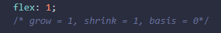

# Flexbox

Class: CSS
Created: July 15, 2022 11:40 PM
Reviewed: No
Type: Video Lessons

### Flex Container

É a tag que envolve os itens, será nela que iremos aplicar a propriedade “display: flex”. Transforma todos os seus itens filhos em flex itens.

Propriedades relacionadas:

- display
- flex-direction
- flex-wrap
- flex-flow

- justify-content
- align-items
- align-content

### Flex Item

São os elementos filhos diretos do Flex Container. E também podem se tornar Flex Container.

Propriedades relacionadas:

- flex-grow
- flex-basis
- flex-shrink

- flex
- order
- align-self

## Flex Container

### Display Flex

Torna a tag um elemento do tipo flex container, e assim automaticamente todos os seus filhos diretos desta tag, tornam-se em flex items.

### Flex Direction

É a propriedade que estabelece o eixo principal do container, definindo assim a direção que os flex items são colocados no flex container.

Os eixos:

- row(padrão): à direção do texto, esquerda para direita
- row-reverse: sentido oposto à direção do texto
- column: ordenação de cima para baixo, em coluna única
- column-reverse: ordenação inversa, de baixo para cima

### Flex Wrap

É a propriedade que define se os itens devem ou não quebrar a linha.

Por padrão eles **não quebram linhas**, isso faz com que os flex itens sejam compactados além do limite do conteúdo.

- nowrap: é o padrão, não permite a quebra de linha.
- wrap: permite a quebra de linha assim que um dos flex itens não puder mais ser compactado.
- wrap-reverse: permite a quebra de linha assim que um dos flex itens não puder mais ser compactado, porém na direção contrária da linha, acima.

### Flex Flow

É um atalho para as propriedades **flex-direction** e **flex-wrap.**

Porém, seu uso não é tão comum, visto que, quando mudamos o flex-direction para column, mantemos o padrão o padrão do flex-wrap que é no wrap.

### Justify Content

Essa propriedade vai se encarregar de alinhar os itens dentro do container de acordo com a direção pretendida e tratar da distribuição de espaçamento entre eles.

OBS.: Caso seus itens estejam ocupando 100% do container ela não se aplica.

Variações:

- flex-start: início do container
- flex-end: final do container
- center: ao centro do container
- space-between: cria um espaçamento igual entre os elementos
- space-around: espaçamento do meio são duas vezes maiores que o inicial e final.

### Align Items

Trata do alinhamento dos flex itens de acordo com o eixo do container.

O alinhamento é diferente para quando os itens estão em colunas ou linhas.

Permite o alinhamento central no eixo vertical.

*A diferença entre o align items e o justify content, é que no caso do align items não precisamos trabalhar com a altura e largura do container ou item, ele próprio aplicará os espaçamentos proporcionalmente.*

Tipos de alinhamento:

- center: alinhamento dos itens ao centro;
- stretch: padrão, os flex items crescem igualmente;
- flex-start: alinhamento dos itens no início;
- flex-end: alinhamento dos itens no final;
- baseline: alinhamento de acordo com a linha de base da topografia dos itens.

### Align Content

É a propriedade responsável por tratar o alinhamento das linhas do container em relação ao eixo vertical do container.

Precisamos que:

- O container utilize quebras de linhas;
- A altura do container seja maior que a soma das linhas do container.

Tipos de alinhamento:

- center: alinhamento dos itens ao centro;
- stretch: é o padrão e os flex itens crescem igualmente;
- flex-start: alinhamento dos itens no início;
- flex-end: alinhamento dos itens no final;
- space-between: cria um espaçamento igual entre os elementos;
- space-around: os espaçamentos do meio são duas vezes maiores que o inicial e final.

## Flex Items

### Flex-grow

Define a proporcionalidade de crescimento dos itens, respeitando o tamanho de seus conteúdos internos.

OBS.: não irá funcionar caso tenhamos adicionado justify-content ao nosso flex container.

### Flex-basis

É a propriedade que estabelece o tamanho inicial do item antes da distribuição de espaço restante dentro dele, usando como base o conteúdo interno disposto.

Valores possíveis:

- auto: caso o item não tenha tamanho, este será proporcional ao conteúdo do item;
- px, %, em, …: são valores exatos previamente definidos;
- 0 (zero): terá relação com a definição do flex-grow.

### Flex-shrink

É a propriedade que estabelece a capacidade de redução ou compressão do tamanho de um item.

### Flex

Esta propriedade é um atalho ou abreviação de escrita para as propriedades: grow, shrink e basis.

### Order

Está ligada diretamente a ordenação de itens. Estabelece a ordem em que os itens serão apresentados no css.

### Align-self

É a propriedade que estabelece o alinhamento de modo individual sobre um determinado item.

Valores possíveis:

- auto: valor padrão, irá respeitar a definição de align-items do container;
- flex-start: ao início do container;
- flex-end: ao final do container;
- center: relativo ao centro de acordo com o eixo;
- stretch: ocupa todo o espaço relativo;
- baseline: utiliza a linha base da tipografia
